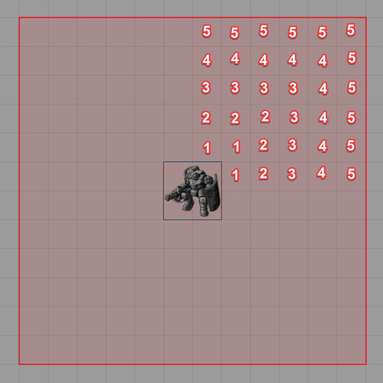
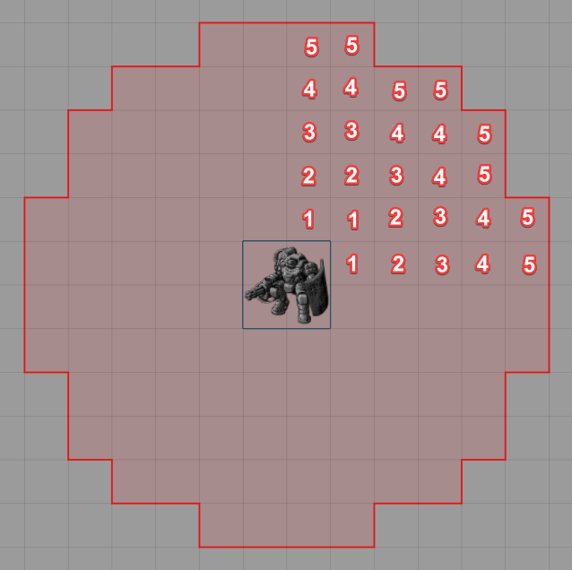
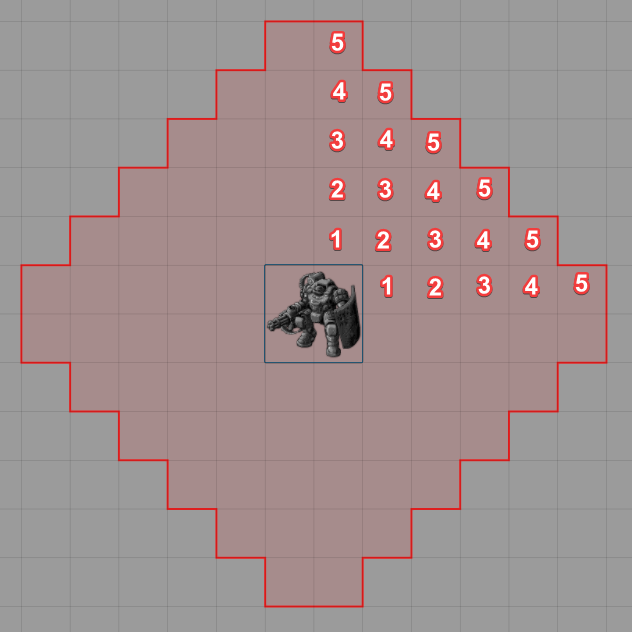
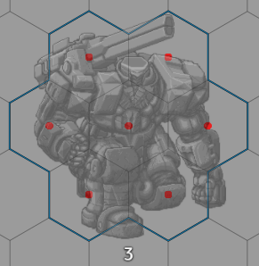

# Grid-Aware Auras

 
[)](https://github.com/Wibble199/FoundryVTT-Grid-Aware-Auras/releases/latest)
[)](https://github.com/Wibble199/FoundryVTT-Grid-Aware-Auras/releases/latest)

A module which draws grid-accurate auras around tokens, which supports any size token and has customisable display styles. Supports the Token Border Supplements (formerly Hex Size Support) module.

## Installation

Simply search for 'Grid-Aware Auras' in the Foundry 'Install Module' screen and install it from there.

Alternatively, paste this URL into the 'Manifest URL' field of the 'Install Module' dialog in the Foundry configuration: `https://github.com/Wibble199/FoundryVTT-Grid-Aware-Auras/releases/latest/download/module.json`, then enable the module in your world.

## Usage

1. First open a token configuration by using the cog button when right-clicking a token on the scene, or open the prototype token configuration for an actor.
2. Then, navigate to the new "Auras" tab, then click the `+` button to create a new aura. You can then set the size of the aura, how you want it to appear visually, [when it should be visible](#visibility), and whether you want to add any [automation functionality](#automation). You can add as many auras as you want!
3. If you need to edit an existing aura, you can click the cog button next to it to edit it. You can also quickly toggle whether that aura is visible by clicking the eye icon.
4. Finally, just click the "Update Token" button.

> [!NOTE]
> For hex grids, GAA only supports cases where the width and height of the token are identical. If this is not the case, the aura will not be shown. Square grids do not have this restriction.

### Visibility

By default, newly created auras are visible to everyone so long as the token itself is visible. This can be changed in the 'Visibility' tab of the aura's config.

There are some options you can choose from in the dropdown, similar to the Foundry's default "Display Bar" option for token resource bars.

You can also fine-tune the visibility conditions, though this is a little more advanced:

The custom setting enables the checkbox table below the dropdown. This table shows a list of 'states' in the first column, followed by a checkbox for owner and non-owner visibility.

GAA computes visibility by checking which states are applicable, determining whether you are an owner of the token or not, then looking up whether the checkbox is ticked; If so, then the aura is visible. If there are multiple applicable states (for example targeted AND hovered), then the aura will show if ANY of the appliable states are ticked. The so-called 'Default' state is slightly special in that it applies ONLY when there are no other applicable states (i.e. when you are NOT hovering, and NOT targeting, and NOT the token's turn etc.).

In the above example, the aura is visible to a user when that user is hovering the token; OR when the token is selected/controlled (only possible by it's owner); OR if the user owns the token and it is that token's turn in the combat tracker.

### Automation

#### Effect

This automation allows adding an effect to a token when it enters the configured aura, and removes it when the token leaves. If multiple auras are applying the same effect, the token must leave all of them for the effect to be removed.

The '_Enable Effect Automation_' setting must be enabled by the GM in the settings for this feature to be available. It defaults to disabled.

- _Effect_ - Select an effect that will be applied to/removed from tokens within the aura.
- _Overlay?_ - If checked, the effect will be added as an overlay (i.e. the icon will appear over the whole token).
- _Target Tokens_ - This is used to limit which tokens have effects applied to them. This is the token disposition as set in the token's config. For example, choosing 'Hostile' will only apply affects to tokens with the 'Hostile' disposition.

#### Macro

This automation executes a macro when a token enters or leaves the aura. Note that this also includes when 'preview' tokens (such as when dragging a token) enter or leave. The arguments passed to the macro are identical to those passed to the [gridAwareAuras.enterLeaveAura hook](./docs/hooks.md#gridawareaurasenterleaveaura). Note that this macro is executed for all players that are currently on the scene.

The '_Enable Macro Automation_' setting must be enabled by the GM in the settings for this feature to be available. It defaults to disabled.

- _Enter/Leave Macro_ - The **ID** of a macro to execute. Paste an ID in, or drag-and-drop a macro from the macrobar or macros folder to use it's ID.

#### Terrain Height Tools

If the Terrain Height Tools module v0.4.7 or newer is installed and activated, the tab will be available. It allows for drawing line of sight rulers between the token that owns the aura and any tokens that are inside the aura while the token is being dragged.

- _Token Ruler on Drag_ - This determines what type of ruler to draw (if any).
	- _Don't show_ - Disables THT integration for this Aura.
	- _Centre Only_ - Shows centre-to-centre rulers.
	- _Centre and Edge_ - Shows centre-to-centre and edge-to-edge rulers.
- _Target Tokens_ - This is used to limit which tokens have line of sight rulers drawn to them. This is the token disposition as set in the token's config. For example, choosing 'Hostile' will only draw line of sight rulers between this token and tokens with the 'Hostile' disposition.

### Square Grids

When dealing with square grids, there are different ways of handling diagonals. You can configure which rules Grid-Aware Auras uses in the module settings. Which one you choose will depend on your game. GAA supports the following:

|Name|Picture|Description|
|-|-|-|
|Equidistant (1/1/1)||In this ruleset, moving diagonally always costs 1 (i.e. the same as moving horizontally or vertically). Therefore, the resulting aura ends up being a large square around the token. For example, this is how D&D5E usually works.|
|Alternating (1/2/1)||In this ruleset, the first diagonal costs 1, the second 2, the third 1 again, then 2 again, etc. This is the technique that Pathfinder 2E uses, for example.|
|Manhattan||In this ruleset, diagonals are effectly disallowed. Moving 1 square diagonally would always cost 2 (1 horizontal and 1 vertical).|

_(Numbers are for illustrative purposes only)_

### Collision Detection

A quick note on collision detection: the collisions to test if a token is inside an aura is done by checking the centre of each cell under the token. For example, on a hex grid with a large token, the points tested would be here (shown in red):

GAA does not check from the vertices of the token's border because rounding errors and imprecision with the geometry can cause false positives. It's far easier to just check the centre cells like this and in most cases it will make little difference. In future I _may_ change this or add alternative methods, but for now it will stay like this.

## See Also
- [API Reference](./docs/api.md)
- [Hooks](./docs/hooks.md)

## Roadmap

Features that I will be looking to add to Grid-Aware Auras in future (in rough order of priority):

- [ ] Formal API for creating/updating/deleting auras on tokens.
- [ ] Allow auras on items, which will get added to the token when owned by that token's actor.
- [ ] Setting auras by active effects (e.g. allowing effects to alter the range of an aura).
